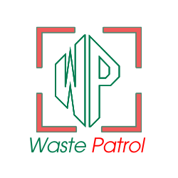

# 🗑️ Waste Patrol - Smart Waste Management System

A comprehensive waste management platform that combines AI-powered waste detection with citizen reporting and authority management tools.



## 🌟 Key Features

- **🤖 AI-Powered Detection**: Automatic waste detection, classification, and volume estimation using YOLO v8
- **📱 Smart Reporting**: Citizens upload images with automatic compression and AI analysis
- **🗺️ Public Heatmap**: Real-time visualization accessible without login
- **👥 Multi-Role System**: Citizens, Authorities, and Admins with different access levels
- **📊 Interactive Dashboards**: Comprehensive analytics and management tools
- **🔒 Secure & Scalable**: JWT authentication, rate limiting, and MongoDB database

## 🏗️ Architecture

### Frontend (React 18)
- Modern React with Material-UI components
- Interactive maps with Leaflet/React-Leaflet
- Real-time dashboards and analytics
- Responsive design for all devices

### Backend (Node.js/Express)
- RESTful API with JWT authentication
- MongoDB database with geospatial indexing
- File upload handling with Multer
- Role-based access control

### AI Service (Python/Flask)
- YOLO v8 model for waste detection
- Image processing with OpenCV
- Volume estimation algorithms
- Real-time inference API

## 🚀 Quick Start

### Prerequisites
- **Node.js** 16+ and npm
- **Python** 3.8+
- **MongoDB** 8.0+ (automatically installed on Windows)
- **Git**

### 🎯 One-Command Start (Windows)
```bash
# Double-click start.bat or run:
start.bat
```

### 📋 Manual Setup

**1. Install Dependencies**
```bash
# Frontend
npm install

# Backend
cd backend && npm install && cd ..

# Python AI Service
cd python_service && pip install -r requirements.txt && cd ..
```

**2. Configure Environment**
```bash
cd backend
cp env.example .env
# MongoDB is automatically configured!
```

**3. Start All Services**
```bash
# Terminal 1 - Backend (port 5000)
cd backend && npm run dev

# Terminal 2 - Python AI (port 8000)  
cd python_service && python run.py

# Terminal 3 - Frontend (port 3000)
npm start
```

**4. Access the Application**
- **Frontend**: http://localhost:3000
- **Public Heatmap**: http://localhost:3000/heatmap (no login required!)
- **Backend API**: http://localhost:5000

## 🆕 Latest Features

### 🗺️ Public Heatmap
- **No Login Required**: Anyone can view waste distribution
- **Real-time Updates**: Live data refresh every 30 seconds
- **Interactive Map**: Click markers for detailed information
- **Priority-based Colors**: Visual representation of waste severity

### 📱 Enhanced Reporting
- **Automatic Image Compression**: Large images compressed to ≤10MB
- **Smart Map Integration**: Clean CartoDB map styling
- **Progress Tracking**: Real-time upload and processing feedback
- **AI Analysis**: YOLO-powered waste detection and volume estimation

### 🎨 UI/UX Improvements
- **Consistent Map Styling**: Clean, minimal design across all pages
- **Better Color Scheme**: Dark green (#1e4d2b) and red (#d32f2f) branding
- **Responsive Design**: Works perfectly on all devices
- **Enhanced Navigation**: Easy access to all features

## 📁 Project Structure

```
waste-patrol/
├── backend/                 # Node.js/Express API
│   ├── models/             # MongoDB models
│   ├── routes/             # API routes
│   ├── services/           # Business logic
│   ├── middleware/         # Auth & validation
│   └── server.js           # Main server file
├── python_service/         # Python AI service
│   ├── app.py              # Flask application
│   ├── requirements.txt    # Python dependencies
│   └── run.py              # Service runner
├── src/                    # React frontend
│   ├── components/         # Reusable components
│   ├── pages/              # Page components
│   ├── contexts/           # React contexts
│   └── App.js              # Main app component
├── public/                 # Static assets
├── train5_11.pt           # YOLO model file
└── README.md
```

## 🔧 Configuration

### Backend Environment Variables (.env)
```env
PORT=5000
MONGODB_URI=mongodb://localhost:27017/waste_patrol
JWT_SECRET=your-super-secret-key
PYTHON_SERVICE_URL=http://localhost:8000
MAX_FILE_SIZE=10485760
```

### Frontend Configuration
The frontend automatically connects to the backend at `http://localhost:5000` via the proxy setting in `package.json`.

## 📊 API Endpoints

### Authentication
- `POST /api/auth/register` - Register new user
- `POST /api/auth/login` - User login
- `GET /api/auth/profile` - Get user profile

### Reports
- `POST /api/reports` - Create waste report
- `GET /api/reports` - Get reports (with filters)
- `GET /api/reports/:id` - Get single report
- `PUT /api/reports/:id/assign` - Assign report to authority
- `PUT /api/reports/:id/resolve` - Mark report as resolved

### Dashboard
- `GET /api/dashboard/stats` - Get dashboard statistics
- `GET /api/dashboard/heatmap` - Get heatmap data
- `GET /api/dashboard/recent-activity` - Get recent activity

## 🎯 User Roles

### Citizens
- Upload waste images with location
- View their submitted reports
- Track resolution status
- Access basic statistics

### Authorities
- View all waste reports in their area
- Assign reports to team members
- Mark reports as resolved
- Access comprehensive dashboard
- View heatmaps and analytics

### Admins
- Full system access
- User management
- System configuration
- Advanced analytics

## 🤖 AI Model Integration

The system uses a custom-trained YOLO v8 model (`train5_11.pt`) for waste detection. The model can identify:

- Plastic bottles and bags
- Food waste
- Paper and cardboard
- Glass containers
- Metal cans
- Electronic waste
- Hazardous materials

### Volume Estimation
The system estimates waste volume using:
1. Bounding box area calculation
2. Depth estimation algorithms
3. Real-world scale conversion
4. Multiple object aggregation

## 🗺️ Heatmap Features

- Real-time waste distribution visualization
- Volume-based intensity mapping
- Priority-based color coding
- Interactive filtering options
- Geographical clustering
- Historical trend analysis

## 📱 Mobile App Ready

The API-first architecture makes it easy to integrate with mobile applications:

- RESTful endpoints
- JWT token authentication
- File upload support
- Geolocation integration
- Real-time updates
- Offline capability support

## 🔒 Security Features

- JWT-based authentication
- Role-based access control
- Input validation and sanitization
- Rate limiting
- Secure file upload
- CORS protection
- Helmet.js security headers

## 🚀 Deployment

### Production Environment
1. Set up MongoDB Atlas or self-hosted MongoDB
2. Deploy backend to cloud service (AWS, Heroku, etc.)
3. Deploy Python service with GPU support for faster inference
4. Build and deploy React frontend to CDN
5. Configure environment variables
6. Set up monitoring and logging

### Docker Deployment (Optional)
```bash
# Build and run with Docker Compose
docker-compose up -d
```

## 🤝 Contributing

1. Fork the repository
2. Create a feature branch
3. Make your changes
4. Add tests if applicable
5. Submit a pull request

## 📄 License

This project is licensed under the MIT License - see the LICENSE file for details.

## 🆘 Support

For support and questions:
- Create an issue in the GitHub repository
- Contact the development team
- Check the documentation wiki

## 🙏 Acknowledgments

- YOLO v8 by Ultralytics
- OpenStreetMap for mapping data
- Material-UI for React components
- MongoDB for database services
- All contributors and testers

---

**Waste Patrol** - Making cities cleaner with smart technology! 🌍♻️
